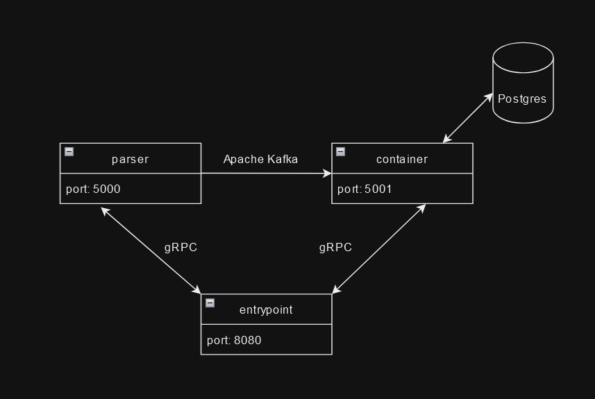

# godex
Hoogle-like search engine for Go, literally Google

## Build And Run:

To build this project use Docker (it will take some time):
```shell
docker compose --file deployments/docker-compose.yml build
```

And to run:
```shell
docker compose --file deployments/docker-compose.yml up -d
```

## API

### Store
Provide the link to raw .go file (hostname must be from `WHITE_LIST`) and parser will get all the functions for it to store in the database. Database is empty from the start, so you can store the functions you want to

- **URL**: `/store`
- **Method**: `POST`
- **Request Body**:
  ```json
  {
    "link": "https://raw.githubusercontent.com/golang/go/master/src/sync/mutex.go"
  }

### Find
Provide the signature to find all the functions with such signature in database. On success, responses with an array of functions

- **URL**: `/find`
- **Method**: `GET`
- **Request Body**:
  ```json
  {
    "signature": "(int)string"
  }
  
## Architecture

